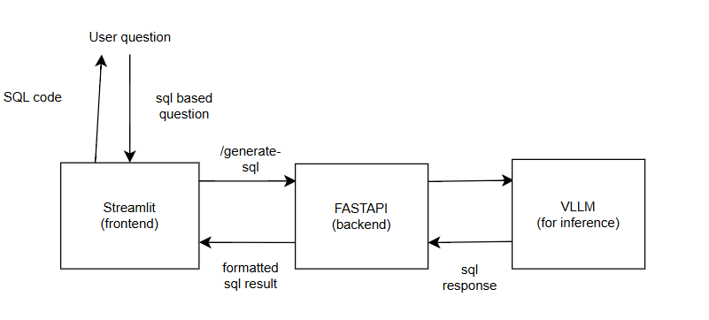

# AI SQL Assistant
Need SQL but don't want to write it? 
This tool converts your natural language questions into SQL queries instantly.
Perfect for analysts, developers, or anyone who prefers plain English over SQL syntax.
Built with Docker for easy deployment and powered by codellama 7b.

## Features

- ⭐ Natural language to SQL conversion
- ⭐ Interactive chat interface (Streamlit)
- ⭐ Real-time query generation (thanks to VLLM)
- ⭐ Docker-based deployment

## Some details about model I have been using 

The system uses a fine-tuned version of codellama that was trained by myself using DPO approach.
Tuning on 7.000 examples from the original dataset took me about 3 hours.
- ⭐ DPO dataset: [zerolink/zsql-sqlite-dpo](https://huggingface.co/datasets/zerolink/zsql-sqlite-dpo)
- ⭐ My model:[dxnay/codellama-7b-text2sql-DPO](https://huggingface.co/dxnay/codellama-7b-text2sql-DPO)
- ⭐ Hardware: selectel VM with NVIDIA A100 GPU

## Setup
Download CodeLlama model:
```bash
mkdir codellama_merged
huggingface-cli download dxnay/codellama-7b-text2sql-DPO --local-dir codellama_merged
```

## How to use?
1. Open streamlit URL in your browser
2. Wait for model to load (~on my pc it took 8-9 mins)
3. Ask questions!

## 🏗️ Architecture

An flow example:


## Video demo:
[!Short usage demo]](https://drive.google.com/file/d/1Qj6sBufLrO8OHwmbvz_Pmih0AL8Ey62W/view?usp=sharing)

